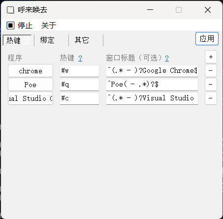
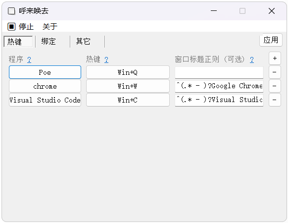
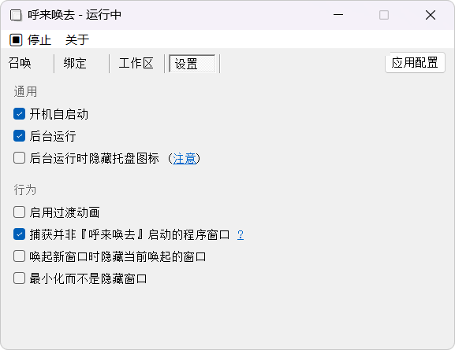

# 呼来唤去 — 全局老板键

<figure>
    
    <!-- <figcaption>演示</figcaption> -->
</figure>

## 功能

- 召唤：为任意程序自定义老板键，随叫随到
- 绑定：为当前窗口绑定老板键，来去自如
- 工作区：将窗口显示状态保存为工作区，一键切换

### 可选

- 开机自启、最小化到托盘
- 多种窗口匹配模式，自动 / 进程、类名、标题
- 唤起新窗口时隐藏其他已唤起的窗口
- 用最小化代替隐藏
- 打开/关闭过渡动画

## 截图

<figure>
    
    <!-- <figcaption>召唤配置</figcaption> -->
</figure>
<figure>
    
    <!-- <figcaption>绑定配置</figcaption> -->
</figure>
<figure>
    
    <!-- <figcaption>工作区配置</figcaption> -->
</figure>
<figure>
    
    <!-- <figcaption>设置</figcaption> -->
</figure>

## 下载

> 更新时请覆盖上一个版本，配置会保留

## Q&A

**无法操作 UWP 窗口和系统窗口？**

以管理员身份运行呼来唤去可以解决。

**使用进程+类名模式时无法隐藏窗口？**

有些应用的窗口类名是动态生成的，可能需要手动修改类名的表达式（或留空类名）。

**还原工作区后窗口叠放顺序不正确？**

这个问题没找到好的解决方案，完美还原叠放顺序速度太慢。目前只保证活跃窗口在最前方，其他窗口叠放顺序可能有变化。

## Todos
- [ ] 优化工作区的切换逻辑
- [ ] 在设置中增加以管理员权限运行的选项。解决在以管理员权限运行时开机自启失效的问题。
- [ ] 思考一下切换一组窗口/保存一组窗口的位置。。这样的功能有什么好的实现方式
- [x] 更丰富的捕获方式配置，支持匹配窗口标题、进程、类名
- [x] 用 GUI 嗅探窗口信息
- [x] 在托盘菜单中列出目前隐藏的窗口，允许单独还原
- [x] 切换工作区时复原窗口位置、大小
